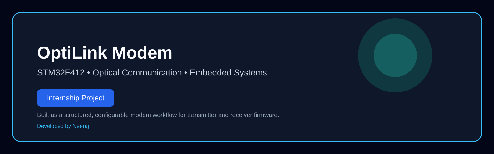

# OptiLink Modem

This project is a modular, configurable optical communication modem built around STM32F412 firmware for both transmitter and receiver sides. It combines signal-processing concepts, timing recovery, framing logic, telemetry, and firmware organization into a clear modem-style architecture.

Developed by Neeraj as a structured embedded-systems engineering project with a clear TX/RX modem workflow and professional repository presentation.

## Project purpose

The system is designed for a practical optical communication link:
- the transmitter constructs and emits framed payloads,
- the receiver recovers weak signals, synchronizes timing, and decodes information,
- the firmware remains configurable for further PHY and reliability improvements.

## What is included

- transmitter firmware for packet generation and transmission,
- receiver firmware for sensing, filtering, timing recovery, decoding, and diagnostics,
- modular configuration for timing, framing, and codec behavior,
- UART-based telemetry for debugging and validation,
- a layered architecture that separates signal processing from protocol-level behavior.

## Repository structure

- RX.V3/: receiver firmware project
- TX.V3/: transmitter firmware project
- docs/: architecture, development, and roadmap documentation
- assets/: diagrams and supporting visuals
- LICENSE: project license

## System architecture

### Visuals

- Hero banner: [assets/hero_banner.svg](assets/hero_banner.svg)
- Block diagram: [assets/tx_rx_block_diagram.svg](assets/tx_rx_block_diagram.svg)
- System flow: [assets/system_flowchart.svg](assets/system_flowchart.svg)
- Architecture diagram: [assets/architecture_diagram.svg](assets/architecture_diagram.svg)
- Visual guide: [docs/visuals.md](docs/visuals.md)

## Core capabilities

- modular DSP, DPLL, MAC, and diagnostics separation
- configurable sync, timing, and codec settings
- adaptive receiver slicing and threshold behavior
- packet sequencing and reliability tracking
- runtime telemetry for link health and debugging

## Small project showcase

This project is intended to present a compact but credible embedded modem workflow:
- TX firmware builds and emits framed data,
- the optical link path is modeled as a practical communication channel,
- RX firmware recovers timing, decodes symbols, and reports diagnostics.

Digital twin / demo link placeholder:
- Add digital twin URL here: [Replace with digital twin URL](#)

## Build and validation

Both firmware projects are built with CMake and STM32-compatible toolchains.

### Build

From the workspace root:

- RX.V3: `cmake --build RX.V3/build/Debug`
- TX.V3: `cmake --build TX.V3/build/Debug`

### Project status

- the firmware is organized around clear modular development,
- both TX and RX targets are set up for further hardware validation,
- the repository is prepared for technical review and presentation.

## Documentation

- [docs/hardware_architecture.md](docs/hardware_architecture.md)
- [docs/setup_usage.md](docs/setup_usage.md)
- [docs/config_reference.md](docs/config_reference.md)
- [docs/tx_rx_sync_guide.md](docs/tx_rx_sync_guide.md)
- [docs/technical_summary.md](docs/technical_summary.md)
- [docs/development_guide.md](docs/development_guide.md)
- [docs/faq.md](docs/faq.md)
- [docs/roadmap.md](docs/roadmap.md)
- [docs/project_overview.md](docs/project_overview.md)
- [docs/index.md](docs/index.md)

## Project presentation

This repository is structured to communicate the project clearly:
- it presents a defined objective and architecture,
- it shows the TX/RX workflow in a direct way,
- and it includes visual documentation for easier understanding.

## Ownership

This repository is maintained as a personal engineering project with structured documentation and a clear technical presentation.

## GitHub push helper

A helper script is available at [scripts/push_to_github.ps1](scripts/push_to_github.ps1) for connecting the repository to a GitHub remote and pushing the current branch.
