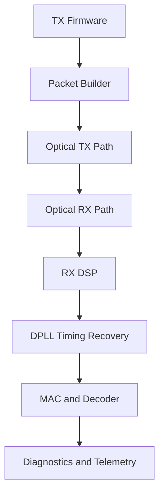

# Hardware and Firmware Architecture

## Overview

The system is built around two STM32-based firmware projects: one transmitter node and one receiver node. Together, they form a compact optical communication chain that can be adapted for open-space communication, underwater optical links, or optical-fiber-based modem behavior.

## Communication concept

The project is based on a practical optical modem model in which the transmitter converts digital data into a waveform that can be detected by the receiver through an optical channel. The receiver then estimates the transmitted symbols, recovers timing, and reconstructs the original information.

The same architecture can be used for different physical media because the modem layers are separated from the channel details:
- open-space optical communication: strong sensitivity to alignment, ambient light, and noise,
- underwater optical communication: affected by scattering, turbidity, and path attenuation,
- optical fiber communication: lower attenuation and more stable channel conditions, but still dependent on clock recovery and symbol timing.

## Transmitter side

The transmitter prepares the frame structure and outputs a waveform suitable for the selected optical channel. In this implementation, the TX side is responsible for:
- building packets from user input,
- fragmenting larger payloads into manageable chunks,
- applying framing and synchronization patterns,
- and generating a transmit waveform that the receiver can detect.

## Receiver side

The receiver recovers information from an imperfect physical channel. It must interpret the incoming signal, identify useful transitions, maintain synchronization, and validate whether the received frame is coherent. This includes:
- sensing the optical signal,
- processing the waveform,
- recovering timing and alignment,
- decoding information from the received symbols,
- and reporting telemetry for debugging and analysis.

## Communication schemes

The system is designed around a simple modem-style framework that can support multiple schemes. The current implementation is best understood as a baseband symbol-based optical link with framing and timing recovery. In practice, the signal can be viewed as:

$$s(t) = A \cdot x(t) \cdot p(t) + n(t)$$

where:
- $A$ is the optical amplitude or drive strength,
- $x(t)$ is the symbol waveform,
- $p(t)$ is the pulse-shaping or modulation envelope,
- $n(t)$ is noise or channel distortion.

For a simple on-off or pulse-like optical signalling scheme, the receiver can estimate the incoming symbol by comparing the measured intensity against a threshold. In a more advanced version, the system can be extended to use pulse-position, Manchester-style, or more robust coding methods.

## Synchronization and timing math

A modem must recover timing so the receiver samples the waveform at the correct instants. The basic timing relation is:

$$t_k = kT_s + \tau$$

where:
- $t_k$ is the sampling instant,
- $T_s$ is the symbol period,
- $k$ is the sample index,
- $\tau$ is the timing offset.

The receiver estimates the timing error using a phase or timing error function. A common form is:

$$e[n] = \hat{s}[n] \cdot \left( \hat{s}[n] - \hat{s}[n-1] \right)$$

or, more generally, a timing-recovery loop adjusts the estimated sampling instant as:

$$\tau_{n+1} = \tau_n + \mu e[n]$$

where:
- $\mu$ is the loop gain,
- $e[n]$ is the timing-error estimate.

This is the core idea behind the receiver’s synchronization behavior: it continuously corrects the sampling phase so the decoder sees the waveform at the proper instant.

## TX and RX configuration parameters

The transmitter and receiver are both configured through parameters that control synchronization, framing, and signal interpretation.

### Transmitter-side parameters

Typical TX-side configuration values include:
- frame length or payload size,
- preamble or sync pattern,
- symbol period or bit-time,
- amplitude or drive level,
- packet spacing or inter-frame gap,
- selected encoding or modulation mode.

These parameters control how the TX generates the waveform. For a simple timing model, the symbol period is directly related to the bit rate:

$$R_b = \frac{1}{T_s}$$

where $R_b$ is the bit rate and $T_s$ is the symbol duration.

### Receiver-side parameters

Typical RX-side configuration values include:
- threshold level for symbol decision,
- timing recovery gain,
- sampling offset,
- sync detection window,
- packet timeout,
- lock threshold or lock hysteresis,
- noise or signal-quality tolerance.

The receiver uses a decision rule of the form:

$$\hat{x}_k = \begin{cases}
1, & r_k > V_{th} \\
0, & r_k \le V_{th}
\end{cases}$$

where:
- $r_k$ is the sampled received value,
- $V_{th}$ is the decision threshold,
- $\hat{x}_k$ is the decoded symbol.

## Layered architecture

The design is intentionally layered to make the system easier to reason about and extend:
- signal processing layer: prepares and interprets the received waveform,
- timing recovery layer: maintains synchronization and lock tracking,
- framing and MAC-like layer: detects packets, validates structure, and handles sequencing,
- diagnostics and configuration layer: provides runtime insight and tuning control.

## Design intent

The system is organized to remain modular and extensible. This makes it suitable for future work such as:
- stronger coding schemes,
- robust error recovery,
- adaptive link tuning,
- better reliability mechanisms,
- and more realistic hardware testing under changing optical conditions.

## Why this structure matters

A modem-style architecture is valuable because it turns the project from a simple data-transfer prototype into a structured communication system. Each layer has a well-defined responsibility, which improves maintainability, clarity, and future expansion.
