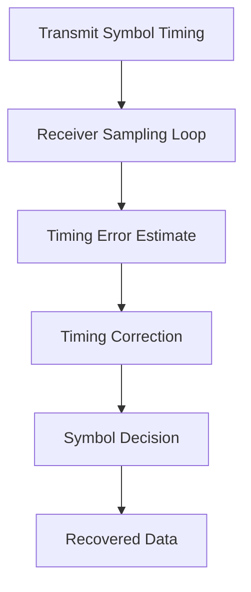

# TX / RX Synchronization Guide

## Purpose

This document explains the main technical ideas needed for transmitter and receiver synchronization in the OptiLink modem project.

## Core synchronization idea

The transmitter and receiver must agree on the symbol timing. If the receiver samples too early or too late, the decoded symbols become incorrect.

The sampling time is modeled as:

$$t_k = kT_s + \tau$$

where:
- $t_k$ is the sampling instant,
- $T_s$ is the symbol period,
- $k$ is the sample index,
- $\tau$ is the timing offset.

## Timing recovery

The receiver updates timing using an error estimate and a loop gain:

$$\tau_{n+1} = \tau_n + \mu e[n]$$

where:
- $\mu$ is the timing recovery gain,
- $e[n]$ is the timing error estimate.

## Symbol decision

After timing recovery, the receiver uses a threshold to decide between symbol states:

$$\hat{x}_k = \begin{cases}
1, & r_k > V_{th} \\
0, & r_k \le V_{th}
\end{cases}$$

where:
- $r_k$ is the sampled received value,
- $V_{th}$ is the threshold,
- $\hat{x}_k$ is the decoded symbol.

## TX-side parameters

The transmitter should be configured with:
- symbol period or bit time,
- frame sync pattern,
- payload length,
- amplitude or drive level,
- spacing between packets.

## RX-side parameters

The receiver should be configured with:
- threshold level,
- timing recovery gain,
- sync detection window,
- sampling offset,
- packet timeout,
- lock threshold.

## Practical interpretation

A well-synchronized system requires the TX and RX to agree on:
- the expected symbol duration,
- the expected framing pattern,
- and the decision threshold used by the receiver.

Without these values being consistent, the receiver will drift or misdecode the transmitted symbols.
